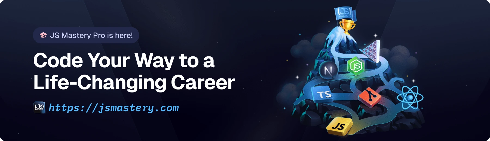

<div align="center">
  <br />
    <a href="https://www.youtube.com/watch?v=iYOz165wGkQ" target="_blank">
      
    </a>
  <br />

  <div>
    
        
        
    
  </div>

  <h3 align="center">Cek Resume</h3>

   <div align="center">
     Build this project step by step with our detailed tutorial on <a href="https://www.youtube.com/watch?v=XUkNR-JfHwo" target="_blank"><b>JavaScript Mastery</b></a> YouTube. Join the JSM family!
    </div>
</div>

## 📋 <a name="table">Table of Contents</a>

1. ✨ [Introduction](#introduction)
2. ⚙️ [Tech Stack](#tech-stack)
3. 🔋 [Features](#features)
4. 🤸 [Quick Start](#quick-start)
5. 🔗 [Assets](#links)
6. 🚀 [More](#more)

## 🚨 Tutorial

This repository contains the code corresponding to an in-depth tutorial available on our YouTube channel, <a href="https://www.youtube.com/@javascriptmastery/videos" target="_blank"><b>JavaScript Mastery</b></a>.

If you prefer visual learning, this is the perfect resource for you. Follow our tutorial to learn how to build projects like these step-by-step in a beginner-friendly manner!

<a href="https://www.youtube.com/watch?v=iYOz165wGkQ" target="_blank"></a>

## <a name="introduction">✨ Pendahuluan</a>

Bangun Penganalisis Resume bertenaga AI dengan React, React Router, dan Puter.js! Terapkan otentikasi tanpa hambatan, unggah dan simpan resume, serta cocokkan kandidat dengan pekerjaan menggunakan evaluasi AI cerdas. Dapatkan umpan balik khusus dan skor ATS yang disesuaikan dengan setiap daftar—semuanya terbungkus dalam UI yang bersih dan dapat digunakan kembali.

Jika Anda baru memulai dan membutuhkan bantuan atau menghadapi bug, bergabunglah dengan komunitas Discord aktif kami dengan lebih dari **50 ribu+** anggota. Ini adalah tempat di mana orang-orang saling membantu.

<a href="https://discord.com/invite/n6EdbFJ" target="_blank"></a>

## <a name="tech-stack">⚙️ Tech Stack</a>

- **[React](https://react.dev/)** is a popular open‑source JavaScript library for building user interfaces using reusable components and a virtual DOM, enabling efficient, dynamic single-page and native apps.

- **[React Router v7](https://reactrouter.com/)** is the go‑to routing library for React apps, offering nested routes, data loaders/actions, error boundaries, code splitting, and SSR support—all with a smooth upgrade path from v6.

- **[Puter.com](https://jsm.dev/resumind-puter)** is an advanced, open-source internet operating system designed to be feature-rich, exceptionally fast, and highly extensible. Puter can be used as: A privacy-first personal cloud to keep all your files, apps, and games in one secure place, accessible from anywhere at any time.

- **[Puter.js](https://jsm.dev/resumind-puterjs)** is a tiny client‑side SDK that adds serverless auth, storage, database, and AI (GPT, Claude, DALL·E, OCR…) straight into your browser app—no backend needed and costs borne by users.

- **[Tailwind CSS](https://tailwindcss.com/)** is a utility-first CSS framework that allows developers to design custom user interfaces by applying low-level utility classes directly in HTML, streamlining the design process.

- **[TypeScript](https://www.typescriptlang.org/)** is a superset of JavaScript that adds static typing, providing better tooling, code quality, and error detection for developers, making it ideal for building large-scale applications.

- **[Vite](https://vite.dev/)** is a fast build tool and dev server using native ES modules for instant startup, hot‑module replacement, and Rollup‑powered production builds—perfect for modern web development.

- **[Zustand](https://github.com/pmndrs/zustand)** is a minimal, hook-based state management library for React. It lets you manage global state with zero boilerplate, no context providers, and excellent performance through selective state subscriptions.

## <a name="features">🔋 Fitur</a>

👉 **Otentikasi Mudah & Nyaman**: Tangani otentikasi sepenuhnya di browser menggunakan Puter.js—tidak diperlukan backend atau pengaturan.

👉 **Unggah & Penyimpanan Resume**: Biarkan pengguna mengunggah dan menyimpan semua resume mereka di satu tempat, dengan aman dan andal.

👉 **Pencocokan Resume AI**: Sediakan daftar pekerjaan dan dapatkan skor ATS dengan umpan balik khusus yang disesuaikan untuk setiap resume.

👉 **UI Modern, Dapat Digunakan Kembali**: Dibangun dengan komponen yang bersih dan konsisten untuk antarmuka yang tampak hebat dan mudah dipelihara.

👉 **Dapat Digunakan Kembali Kode**: Manfaatkan komponen yang dapat digunakan kembali dan basis kode modular untuk pengembangan yang efisien.

👉 **Kompatibilitas Lintas Perangkat**: Desain responsif penuh yang berfungsi mulus di semua perangkat.

👉 **UI/UX Modern**: Desain bersih, responsif yang dibangun dengan Tailwind CSS dan shadcn/ui untuk pengalaman pengguna yang ramping.

Dan banyak lagi, termasuk arsitektur kode dan kemampuan penggunaan kembali.

## <a name="quick-start">🤸 Mulai Cepat</a>

Ikuti langkah-langkah ini untuk menyiapkan proyek secara lokal di mesin Anda.

**Prasyarat**

Pastikan Anda telah menginstal yang berikut ini di mesin Anda:

- [Git](https://git-scm.com/)
- [Node.js](https://nodejs.org/en)
- [npm](https://www.npmjs.com/) (Node Package Manager)

**Mengkloning Repositori**

```bash
git clone https://github.com/adrianhajdin/ai-resume-analyzer.git
cd ai-resume-analyzer
```

**Instalasi**

Instal dependensi proyek menggunakan npm:

```bash
npm install
```

**Menjalankan Proyek**

```bash
npm run dev
```

Buka [http://localhost:5173](http://localhost:5173) di browser Anda untuk melihat proyek.

## <a name="links">🔗 Aset</a>

Aset dan cuplikan yang digunakan dalam proyek dapat ditemukan di **[video kit](https://jsm.dev/resumind-kit)**.

<a href="https://jsm.dev/resumind-kit" target="_blank">
  
</a>

## <a name="more">🚀 Lebih Lanjut</a>

**Tingkatkan keterampilan Anda dengan Kursus Lanjutan Next.js**

Menikmati pembuatan proyek ini? Selami lebih dalam kursus PRO kami untuk petualangan belajar yang lebih kaya. Mereka dikemas dengan
penjelasan terperinci, fitur-fitur keren, dan latihan untuk meningkatkan keterampilan Anda. Cobalah!

<a href="https://jsm.dev/resumind-courses" target="_blank">
  
</a>
